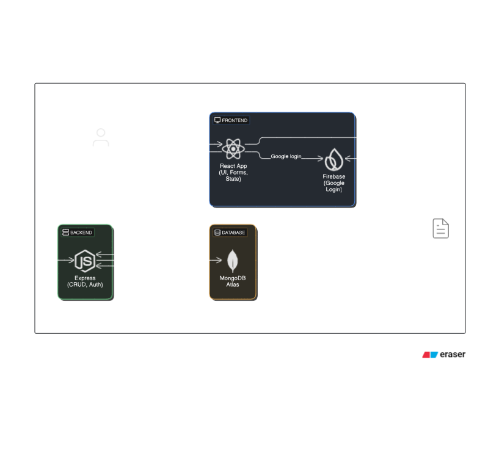

# My Todo Project 📝

This is a full-stack Todo application built for a hackathon. It helps users manage their daily tasks with a simple and intuitive UI.

---

## 🔧 Tech Stack

### Frontend (`todo-client/`)
- React
- Firebase Authentication (Google login)
- Tailwind CSS

### Backend (`todo-backend/`)
- Node.js
- Express.js
- MongoDB (via Mongoose)
- dotenv for environment config

---

## ⚙️ Features

- User login using Google (Firebase Auth)
- Add, edit, delete, and mark todo items
- Tasks stored in MongoDB
- Separate backend and frontend folders for clear modularity

---

## 🏗️ Folder Structure

my-todo-project/
├── todo-client/ # Frontend (React)
├── todo-backend/ # Backend (Express API)
├── .gitignore
└── README.md

## 📐 Architecture Diagram

Watch the working demo with explanation here:
👉 [Demo Video Link](https://drive.google.com/file/d/1Tc14lIljQPjFKjinK4yu3J7MOkPh6ije/view?usp=sharing)

## ✅ Assumptions

- User should already be logged in via Google to access the task page
- MongoDB is hosted on MongoDB Atlas
- `.env` files are used to store sensitive credentials and are **not** pushed to GitHub
- Firebase config is assumed to be available in the frontend under `firebase-config.js`

---

## 🔒 .gitignore

This project uses a `.gitignore` file that excludes:

node_modules/
.env
dist/

## ✅ Hackathon Attribution

**This project is a part of a hackathon run by [https://www.katomaran.com](https://www.katomaran.com)**

---

## 🙋‍♂️ Notes

- Code is modular and readable
- Frontend is responsive and styled with Tailwind CSS
- All features are implemented in a clean and scalable way

---

## 💬 Prompting Disclosure

